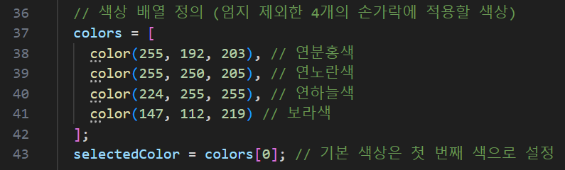
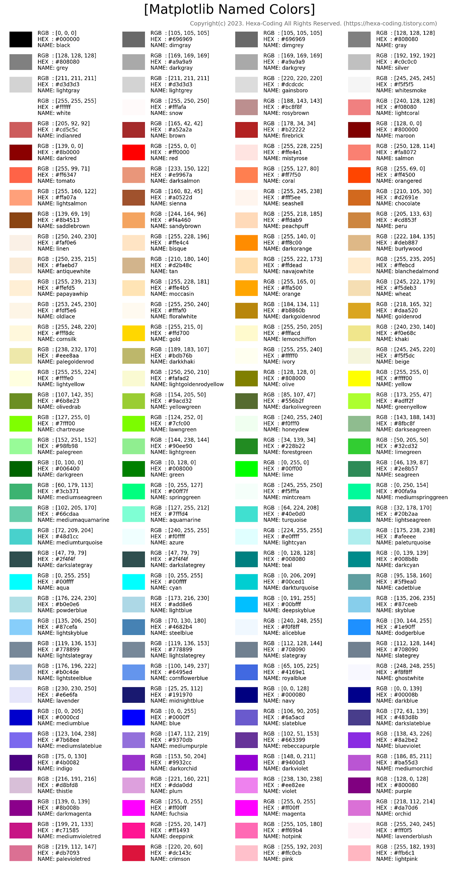
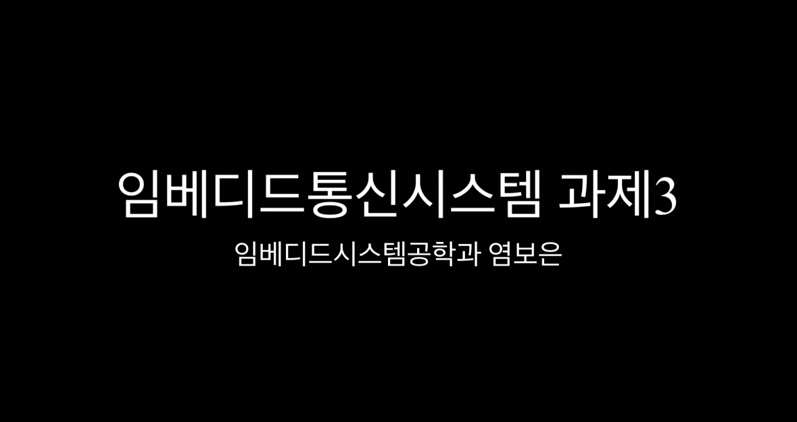

# 📌 임베디드통신시스템 과제3

## 📖 소개

[임베디드통신시스템]강의의 세 번째 과제로 P5.js에서 ml5를 사용하여 핸드제스처를 사용한 Interactive Reactions를 구현하였습니다.  

## 과제 설명
1. 4개 이상의 반응 버튼 혹은 반응 동작
    - "Good! 👍"
    - "Clap 👏"
    - "Welcome 🙌"
    - "OK! 👌"
2. 칠판처럼 글자/그림을 작성
3. 그림 색상 변경 
4. 작성한 글자/그림을 지우기 
5. 이를 동작 후 Virtual Camera를 통해 카메라 디바이스로 인지
    - Manycam 사용 
6. 생성한 Virtual Camera를 Zoom에서 동작시켜 활용

| 실행 반응 | 손 위치와 동작        | 
|----------|----------------------|
| 화면에 👍 띄움 | 왼손 검지를 화면에 "Good! 👍" 버튼에 가져다댐 |
| 화면에 👏 띄움 | 왼손 검지를 화면에 "Clap 👏" 버튼에 가져다댐 |
| 화면에 🙌 띄움 | 왼손 검지를 화면에 "Clap 👏" 버튼에 가져다댐 |
| 화면에 👌 띄움 | 왼손 검지를 화면에 "Clap 👏" 버튼에 가져다댐 |
| 화면에 그림을 그림 | 오른손 엄지와 검지를 맞대어 화면에 그림을 그릴 수 있음 |
| 색상 바꿈 | 왼손 엄지와 검지를 맞대면 연분홍색으로 변경 |
| 색상 바꿈 | 왼손 엄지와 중지를 맞대면 연노랑색으로 변경 |
| 색상 바꿈 | 왼손 엄지와 약지를 맞대면 하늘색으로 변경 |
| 색상 바꿈 | 왼손 엄지와 새끼를 맞대면 보라색으로 변경 |
| 그림 부분 지우기 | 오른손을 쫙 피면 검지 손가락부분으로 그림을 지울 수 있음 |
| 그림 전체 지우기 | 오른손으로 주먹을 쥐면 그렸던 그림 전체를 지울 수 있음 |

### 색상표 
- 색상을 변경하고 싶다면 color(R, G, B)에서 RGB값을 바꾸시면 됩니다. 

---
## 동작 시연 영상

아래 사진을 클릭하면 동작이 시연되는 것을 확인해볼 수 있습니다.

---

## 소프트웨어

### p5.js
1️⃣ 비디오를 통해 손 모양 인식  
2️⃣ 왼손으로 그림 아이콘 띄우기와 색상 조정
3️⃣ 오른손으로 그림그리기
4️⃣ 오른손으로 그림 부분, 전체 지우기 

- 자세한 코드는 코드에 포함되어 있는 주석 참고

___

## 주의 & 참고 사항

- index.html에 아래 코드를 추가시켜야 실행됩니다. 
    
    

---
